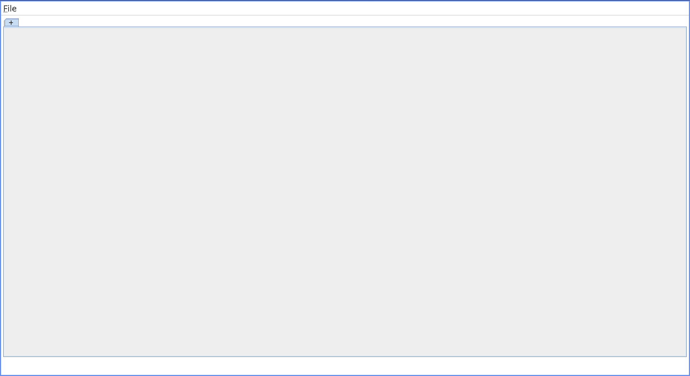
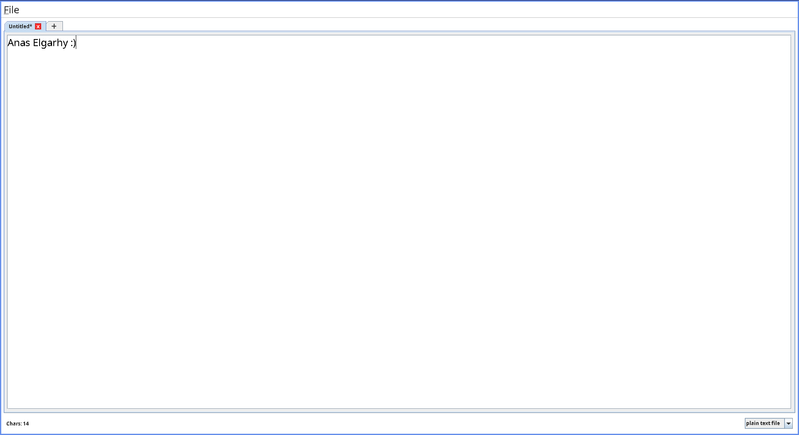
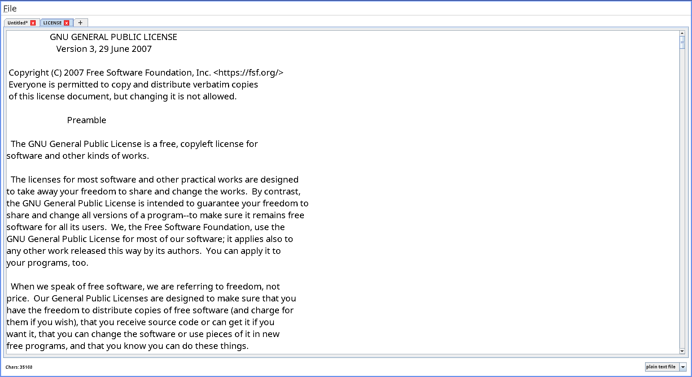
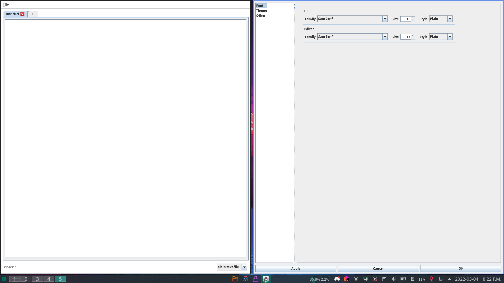
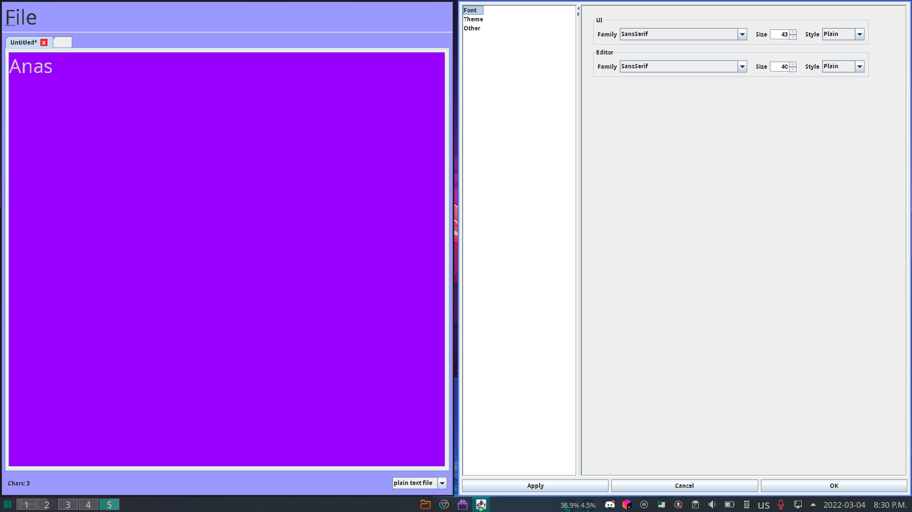

# JSimple Text Editor

[//]: # ( About: JSimple Text Editor)
## About:
### A simple Java text editor, the only important text editor used by geniuses 🤓🗒

[//]: # (Screenshots: JSimple Text Editor)

## Screenshots:

#### License: MIT
#### Version: 0.1.0
